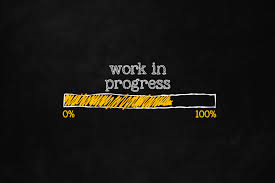

<h1 align="center">
    
</h1>
<h1 align="center">Imersão React Alura</h1>
<p align="center">Project <strong>Diegoflix</strong> developed during the Alura Imersão React.
    Diegoflix is a project similar to Netflix. Developed with NodeJs, ReactJs, Styled Components, Redux among others.
</p>

## Available Scripts
<p align="center">
  <a aria-label="NodeJs version" href="https://github.com/nodejs/node/blob/master/doc/changelogs/CHANGELOG_V12.md#12.14.1">
    </img>
  </a>
  <a aria-label="ReactJs version" href="https://github.com/facebook/react/blob/master/CHANGELOG.md#16120-november-14-2019">
    </img>
  </a>

  </img>
</p>

In the project directory, you can run:
## Instalation
To install the dependencies and to execute the **Frontend**, clone the project on your computer an execute:

### `yarn start`
## Frontend

Runs the app in the development mode.<br />
Open [http://localhost:3000](http://localhost:3000) to view it in the browser.
To run the React's Frontend use:
```bash
# Enter on frontend directory
$ cd diegoflix
The page will reload if you make edits.<br />
You will also see any lint errors in the console.
# Install dependencies
$ npm install
### `yarn test`
# Run
$ npm start
```
</img>

Made with ♥ by Diego Andrade :wave: [Get in touch!](https://www.linkedin.com/in/diego-rodrigo-de-andrade-98a0271a0/)
