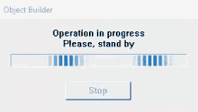

<h1 align="center">
    
</h1>
<h1 align="center">Imersão React Alura</h1>
<p align="center">Project <strong>Diegoflix</strong> developed during the Alura Imersão React.
    Diegoflix is a project similar to Netflix. Developed with NodeJs, ReactJs, Styled Components among others.
</p>

## Available Scripts
<p align="center">
  <!--<a aria-label="NodeJs version" href="https://github.com/nodejs/node/blob/master/doc/changelogs/CHANGELOG_V12.md#12.14.1">
    </img>
  </a> -->
  <a aria-label="ReactJs version" href="https://github.com/facebook/react/blob/master/CHANGELOG.md#16120-november-14-2019">
    </img>
  </a>
  
  <h1 align="center" > Working in Progress..." </h1>
    
  <h1 align="center">
    
  </h1>
</p>

## Instalation
To install the dependencies and to execute the **Frontend**, clone the project on your computer an execute:

```bash
# Enter on frontend directory
$ cd diegoflix
$ npm install
$ npm start
```
Check the application deployed at Vercel here:    
https://diego-flix.vercel.app/

 <h1 align="center">
    </img>
</h1>

Made with ♥ by Diego Andrade :wave: [Get in touch!](https://www.linkedin.com/in/diego-rodrigo-de-andrade-98a0271a0/)
